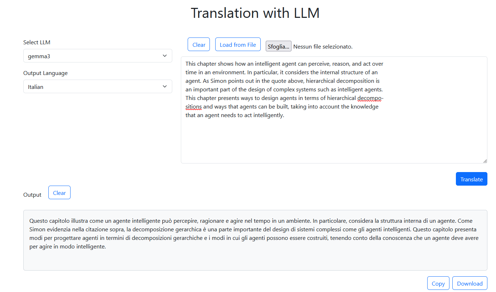
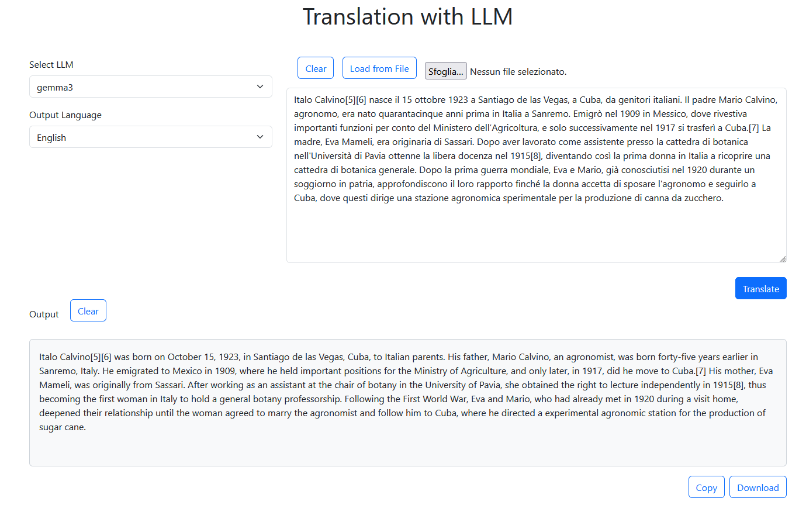
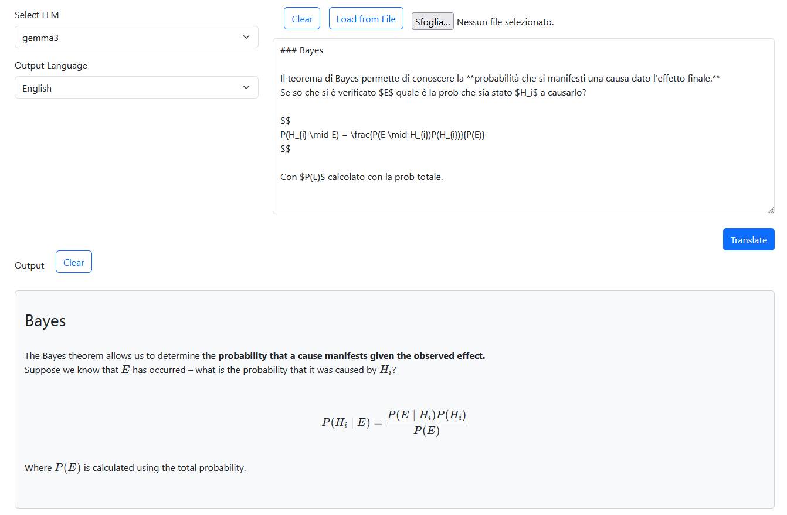

# Translation with local LLM

A lightweight Flask web app for translating text using **locally running LLMs** via [Ollama](https://ollama.com/).


## Features

- ✅ **No subscriptions, APIs, or rate limits** — 100% offline, private, and free
- ✅ **Any Ollama model supported** — Use your preferred LLM (e.g., `llama3`, `mistral`, `qwen`, etc.)
- ✅ **Large text support** — Applies chunking for translating long documents
- ✅ **File input** — Load text directly from `.txt` or `.md` files
- ✅ **Download results** — Save translated output with one click
- ✅ **Formatting preserved** — Markdown, code blocks, LaTeX, and HTML kept intact
- ✅ **Simple & clean UI** — Minimalist web interface, easy to use

## Examples of Usage

- English to Italian translation



- Italian to English translation




- Italian to English with markdown formatting translation



## Install

- Requires Python 3.10 or higher and pip.
- Requires Ollama installed and running on your machine.
- Choose and download an Ollama model from [here](https://ollama.com/search).
- Install the required Python packages:

```bash
pip install -r requirements.txt
```

## Configuration

In the `config.json` file, you can specify:

- `prompt': This prompt will be used to instruct the LLM on how to translate the text. You can customize it to fit your needs.


- `models`: A list of configurations for available LLM models. Each object must include:

    - `name`: The name of the ollama model.
    - `max_word_for_prompt`: Defines the maximum number of words that can be processed in a single model input (prompt). When the input text exceeds this limit, it is automatically split into smaller, manageable chunks. This value should align with the *context window* of the LLM being used (e.g., 8k, 32k, or 128k tokens), but it's not just about fitting the text — it's about **preserving translation quality**. Even if a model supports long contexts, performance often degrades due to the **"lost in the middle"** effect, where information in the central part of long inputs is less likely to be remembered or used accurately. Therefore, using smaller chunks (e.g., 500–1500 words) can significantly improve coherence, consistency, and fidelity in translation. Do some testing to find the optimal chunk size for your specific model and use case.
    - `temperature`: Sampling temperature for the model (lower is more deterministic)
    - `thinking_enabled`: Set this to true if the model supports thinking steps (like deepseek-r1) and you want to enable this feature, any thinking steps will not be included in the final answer.


## Running the app

- Start the Flask app:

```bash
python app.py
```
Then go to `http://127.0.0.1:5000/` in your web browser.

## Pro and Cons of LLM Translation

Unlike traditional rule-based or statistical machine translation methods, LLMs rely on deep learning algorithms and large datasets to produce contextually relevant and grammatically accurate translations. Due to the ability to understand context, idioms, and nuances in language, LLMs can generate translations that are more natural and fluent compared to traditional methods. 

However, they may not be suitable for all translation tasks, especially those requiring deep cultural understanding, specialized domain knowledge, or real-time processing.

Remember that LLMs can sometimes produce unexpected results, especially with complex or ambiguous sentences. Always review translations for critical applications.

Remember to do some test to see if the translation quality meets your needs. LLMs can vary significantly in their performance based on the language pair, domain, and specific model used.

Learn more about [LLM translation](https://www.pairaphrase.com/blog/llm-translation-advantages-disadvantages).